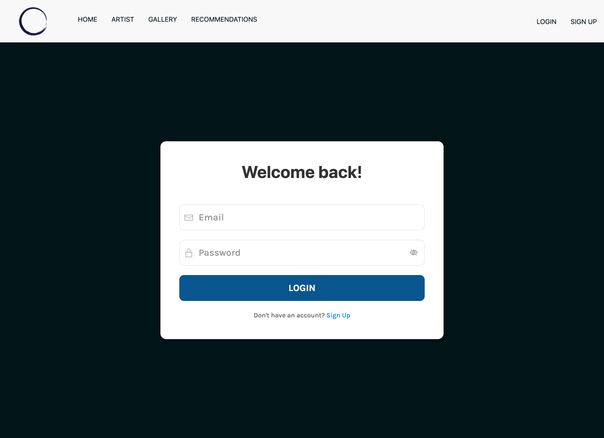
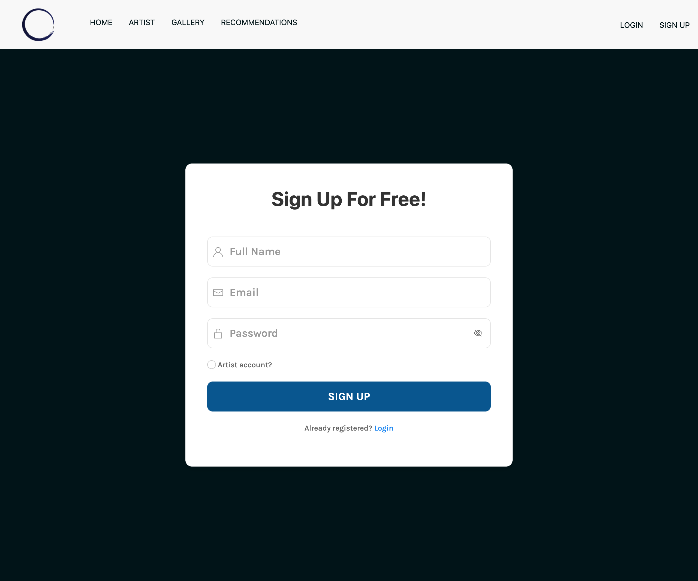
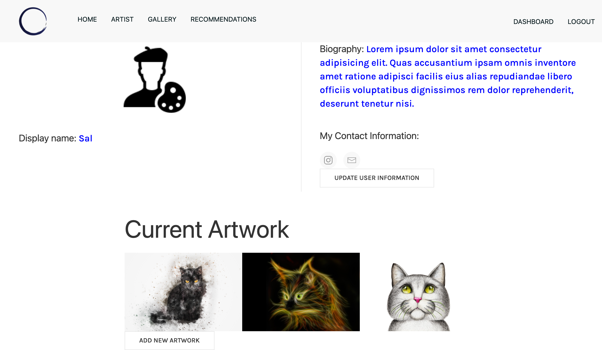
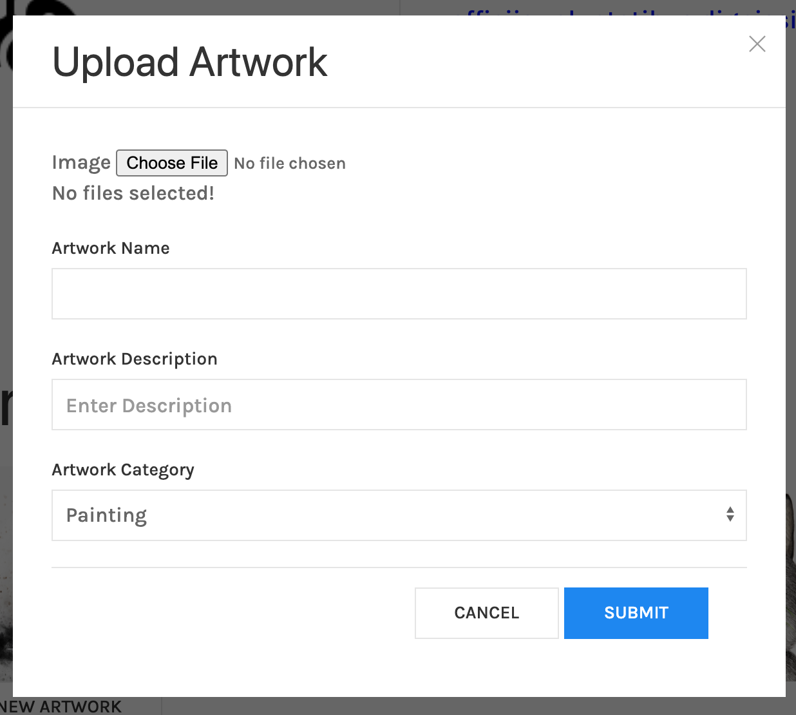
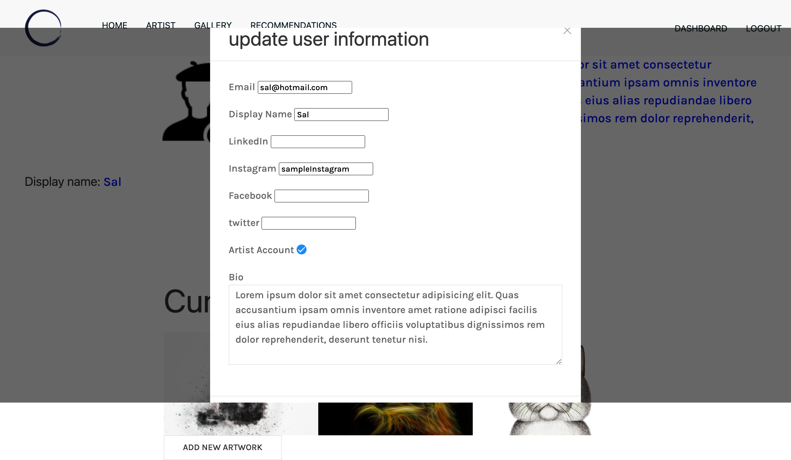

# **All About That Art**: _A Virtual Art Community_

## **Description**  
-------------
_All About That Art_ was built with the idea of creating a virtual art community. Our mission is to inspire individuals to create. We believe in art as therapy, promoting art and creating a safe place for artist and viewers. Users will now have a community to share art and connect with others who are _all about that art_. 

Users will be able to create profiles, as an _Artist_ or an _Art Viewer_. Users will be able to view, comment, and learn about different artist. Users will also have access to our top picks to see art in person.

 ## **How to Use**
 ---------------
- The user would start on the homepage where they will be able navigate the site to view: artist, gallery of the artwork or the recommendations page to see art. The login and sign up button are also found on the homepage. A feature artist work is also included for the users to view.
  

- The user is able to login to their account if they are already signed-up from the _Login Page_. 

- The user can create an account on the _Sign Up Page_ if they have not already signed up for one.

- Once the user is logged on to their account, they will be taken to their dashboard. The user would be able to update their profile information such as, their personal bio, social media accounts, and username. They would also be able to upload their personal artwork to be displayed in the gallery and their artist profiles.
  
   

   

   

- Users can view all the artist who are signed up for an account on the artist page. A user can click on the cards to view their profile page. There the user can view their bio and artwork. 

- Users can get to the artwork page of any piece of art through their favorite artists' profile or through the gallery categories page. Once there, users can also leave comments for the artwork.
  

- Users would also have access to our recommendations for place to see art in person in the Recommendations page.
  

## **Built With**
---------------
- 
- 
- 
- 
- 
- 
- 
- 
## **Contributors**
--------------------
  

- Sandy M. [GitHub](https://github.com/sandra-marr)

- Allysha J. [GitHub](https://github.com/ajovich)

- Mohamed B. [GitHub](https://github.com/MohamedB-01)

- Rudy S. [GitHub](https://github.com/Rudys212)

## **License**
--------------------
-MIT License

Copyright (c) 2021 Sandy Marr

Permission is hereby granted, free of charge, to any person obtaining a copy
of this software and associated documentation files (the "Software"), to deal
in the Software without restriction, including without limitation the rights
to use, copy, modify, merge, publish, distribute, sublicense, and/or sell
copies of the Software, and to permit persons to whom the Software is
furnished to do so, subject to the following conditions:

The above copyright notice and this permission notice shall be included in all
copies or substantial portions of the Software.

THE SOFTWARE IS PROVIDED "AS IS", WITHOUT WARRANTY OF ANY KIND, EXPRESS OR
IMPLIED, INCLUDING BUT NOT LIMITED TO THE WARRANTIES OF MERCHANTABILITY,
FITNESS FOR A PARTICULAR PURPOSE AND NONINFRINGEMENT. IN NO EVENT SHALL THE
AUTHORS OR COPYRIGHT HOLDERS BE LIABLE FOR ANY CLAIM, DAMAGES OR OTHER
LIABILITY, WHETHER IN AN ACTION OF CONTRACT, TORT OR OTHERWISE, ARISING FROM,
OUT OF OR IN CONNECTION WITH THE SOFTWARE OR THE USE OR OTHER DEALINGS IN THE
SOFTWARE.

## **Links** 
---------------
- [GitHub Repo Hosted By Sandy M](https://github.com/sandra-marr/P2_All-About-That-Art)

- [Heroku Deployed Link](https://stark-badlands-81359.herokuapp.com/)